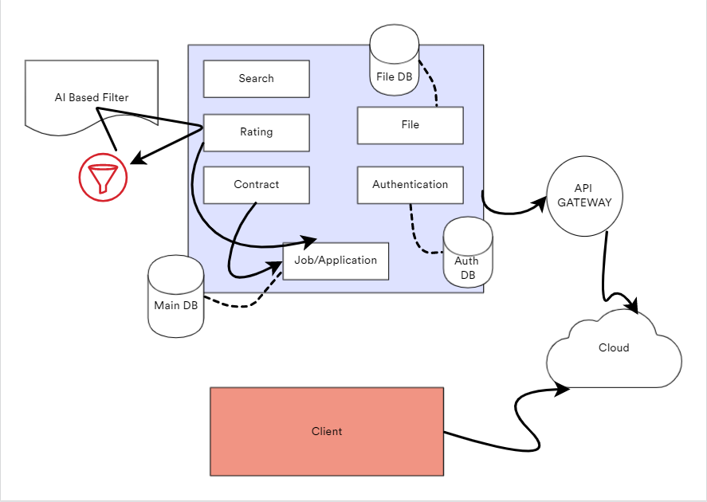

# Documentations

## Diagram

Note: AI Based Filter will remain in the research phase since the idea 
is realized and can be implemented after collecting enough data.

## Components
- Main API : https://main-api.hiringo.tech/openapi/index.html
   - Docs: https://github.com/softech-craftsman-webapp/hiringo#readme
   - Repo: https://github.com/softech-craftsman-webapp/hiringo
   - Dependencies: https://github.com/softech-craftsman-webapp/hiringo/blob/master/go.sum
- Auth API : https://auth.hiringo.tech/openapi/index.html
   - Docs: https://github.com/softech-craftsman-webapp/auth_server#readme
   - Repo: https://github.com/softech-craftsman-webapp/auth_server
   - Dependencies: https://github.com/softech-craftsman-webapp/auth_server/blob/master/go.sum
- Storage API : https://storage.hiringo.tech/openapi/index.html
   - Docs: https://github.com/softech-craftsman-webapp/file_server#readme
   - Repo: https://github.com/softech-craftsman-webapp/file_server
   - Dependencies: https://github.com/softech-craftsman-webapp/file_server/blob/master/go.sum
- Client: https://hiringo.tech 
    - Docs: https://github.com/softech-craftsman-webapp/docs/blob/main/CLIENT.md
    - Repo: https://github.com/softech-craftsman-webapp/client
    - Dependencies: https://github.com/softech-craftsman-webapp/client/blob/master/yarn.lock
- API Gateway: https://api.hiringo.tech
    - Docs: https://github.com/softech-craftsman-webapp/api_gateway#readme
    - Repo: https://github.com/softech-craftsman-webapp/api_gateway
    - Dependencies: https://github.com/softech-craftsman-webapp/api_gateway/blob/master/yarn.lock